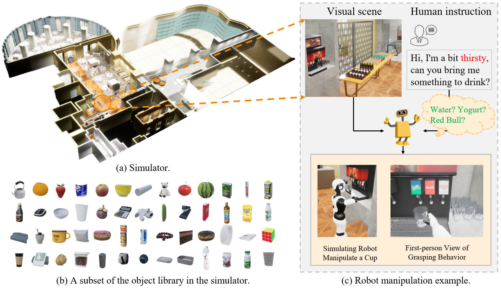

# RM-PRT: Realistic Robotic Manipulation Simulator and Benchmark with Progressive Reasoning Tasks
[[arXiv]](https://arxiv.org/abs/2306.11335) [[Website]](https://necolizer.github.io/RM-PRT/).

**RM-PRT** is a Robotic Manipulation with Progressive Reasoning Tasks benchmark based on a realistic robotic manipulation simulator. Specifically, the RM-PRT benchmark builds a new high-fidelity digital twin scene based on Unreal Engine 5, which includes 782 categories, 2023 object entities, and 15K natural language instructions generated by ChatGPT for a detailed evaluation of robot manipulation.



## Updates
**_8/13/2023_**
- We have released the first version [1.0.0](https://github.com/Necolizer/RM-PRT/releases/tag/v1.0.0) of the RM-PRT benchmark simulator.
   - Built on UE5.
   - Supports [instruction tasks](https://github.com/Necolizer/RM-PRT/blob/main/Env/README.md#tasks) with 4 different difficulty levels.
   - Support for grabbing tasks.
   - Contains 782 object categories and 2023 entities.


## Environment
### Resource Consumption
In our experiments, we used 1 NVIDIA GeForce RTX 3090 GPU. And the simulator occupies approximately 2 to 3GB of GPU memory.
### Simulator Details
You can see details about our simulator in [Env](https://github.com/Necolizer/RM-PRT/blob/main/Env/README.md).
## Getting Started

```bash
git clone -b main https://github.com/Necolizer/RM-PRT.git
```

First download the [simulator](https://drive.google.com/drive/folders/1jLXAU9eHE6rcpLtohepGlb654mUbA4KR?usp=sharing) and open it on your computer. Then download a [model checkpoint](https://drive.google.com/file/d/1shH1DV6_rrq7hS6Zn0LrfT7LXbDQt3Us/view?usp=drive_link).

Run the inference code.
```bash
python inference.py --host=localhost:30001 --action_nums=8
```

## Citation
```
@article{rmprt2023,
      title={RM-PRT: Realistic Robotic Manipulation Simulator and Benchmark with Progressive Reasoning Tasks}, 
      author={Pengzhen Ren and Kaidong Zhang and Hetao Zheng and Zixuan Li and Yuhang Wen and Fengda Zhu and Mas Ma and Xiaodan Liang},
      year={2023},
      journal={arXiv:2306.11335}
}
```
